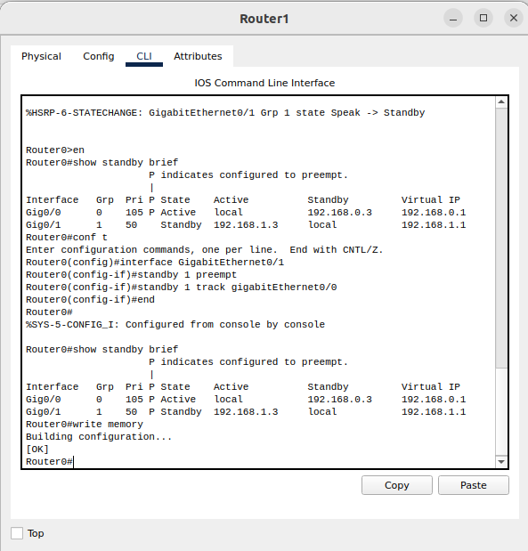
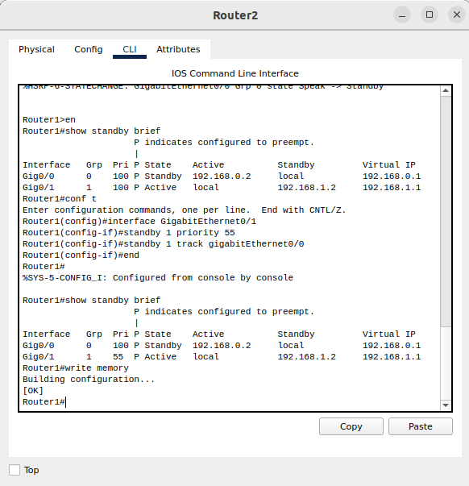
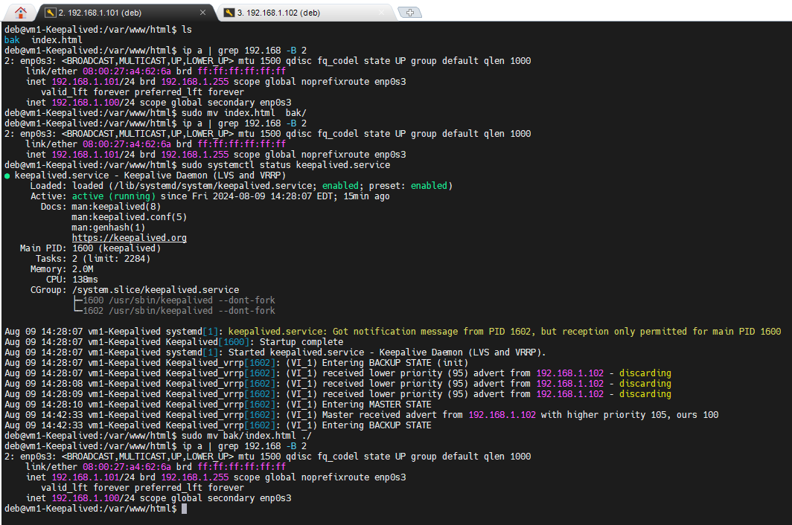
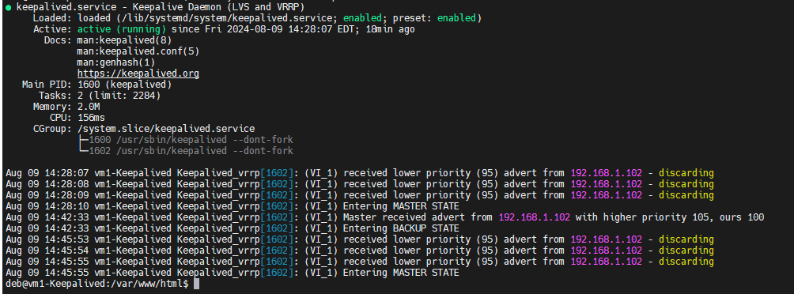
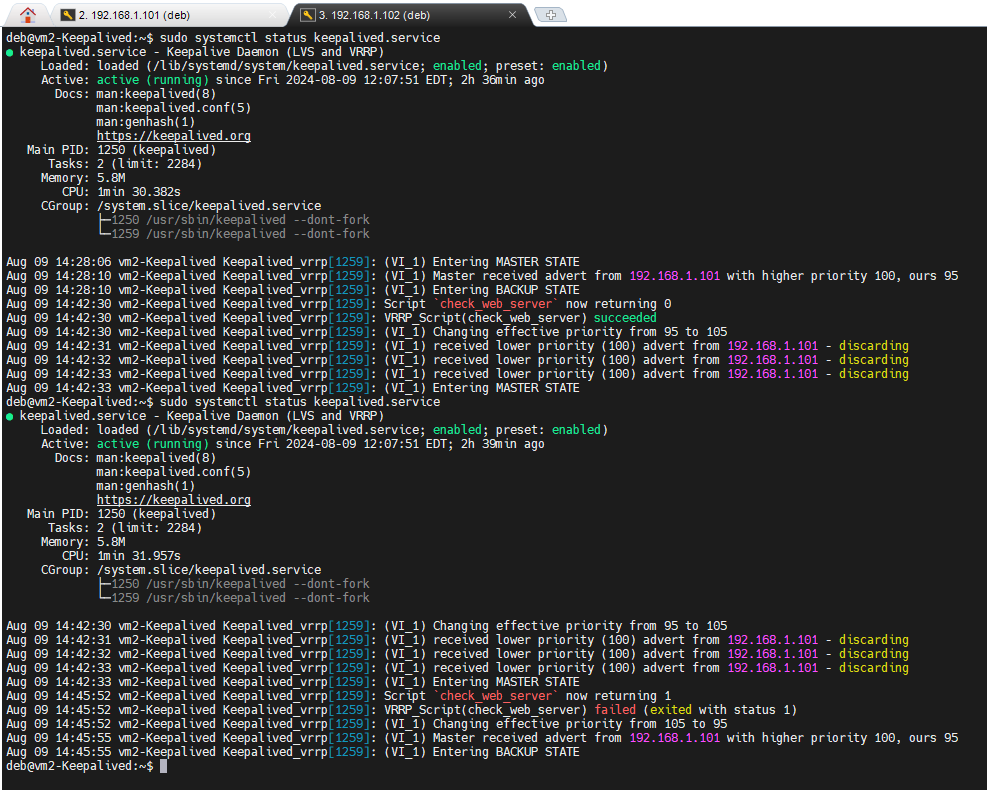

# Домашнее задание к занятию 1 «Disaster recovery и Keepalived»  - `Дмитрий Демченко`

### Задание 1
- Дана [схема](1/hsrp_advanced.pkt) для Cisco Packet Tracer, рассматриваемая в лекции.
- На данной схеме уже настроено отслеживание интерфейсов маршрутизаторов Gi0/1 (для нулевой группы)
- Необходимо аналогично настроить отслеживание состояния интерфейсов Gi0/0 (для первой группы).
- Для проверки корректности настройки, разорвите один из кабелей между одним из маршрутизаторов и Switch0 и запустите ping между PC0 и Server0.
- На проверку отправьте получившуюся схему в формате pkt и скриншот, где виден процесс настройки маршрутизатора.

Схема: [hsrp_advanced_home.pkt](1/hsrp_advanced_home.pkt)

### Настройка маршрутизатора № 1

### Настройка маршрутизатора № 2

------

### Задание 2
- Запустите две виртуальные машины Linux, установите и настройте сервис Keepalived как в лекции, используя пример конфигурационного [файла](1/keepalived-simple.conf).
- Настройте любой веб-сервер (например, nginx или simple python server) на двух виртуальных машинах
- Напишите Bash-скрипт, который будет проверять доступность порта данного веб-сервера и существование файла index.html в root-директории данного веб-сервера.
- Настройте Keepalived так, чтобы он запускал данный скрипт каждые 3 секунды и переносил виртуальный IP на другой сервер, если bash-скрипт завершался с кодом, отличным от нуля (то есть порт веб-сервера был недоступен или отсутствовал index.html). Используйте для этого секцию vrrp_script
- На проверку отправьте получившейся bash-скрипт и конфигурационный файл keepalived, а также скриншот с демонстрацией переезда плавающего ip на другой сервер в случае недоступности порта или файла index.html

Скрипт: [check-available-web-server.sh](conf/check-available-web-server.sh)
Конфиг: [keepalived.conf](conf/keepalived.conf)

#### 192.168.1.101 - Основнй сервер
#### 192.168.1.102 - Резервный сервер
#### 192.168.1.100 - Плавающий сервер

#### Работа основного сервера

#### Работа резервного сервера

